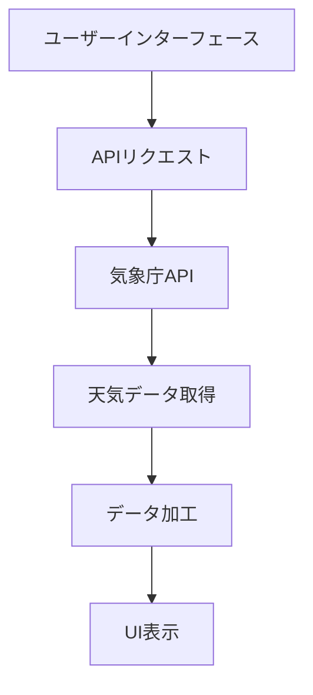

# 天気予報アプリ設計書

## システム構成

## 主要コンポーネント
### 検索フォーム
- 都市名入力フィールド
- 検索ボタン
- 現在地取得ボタン（Geolocation API）

### 天気表示カード
- 現在の天気セクション
- 5日間予報セクション（時間別/日別）
- 気象警報表示セクション

### 通知コンポーネント
- プッシュ通知管理
- 警報アラート表示
- 通知設定インターフェース

### API連携モジュール
- 気象庁APIクライアント
- データフォーマット変換
- エラーハンドリング
- 地域コード変換機能
- 気象警報通知機能

## UIデザイン要件
- カラースキーム：ブルー基調（天候イメージ）
- レスポンシブグリッドレイアウト
- モーダルダイアログ（エラー表示用）
- ローディングインジケーター
- PWA対応（ホーム画面追加機能）
- オフライン表示モード
- ダークモード対応

## API仕様
+ 使用エンドポイント：
+  - 気象庁JSON API（地域予報）
+  - 気象庁LDM（ Lightning Detection Method）データ
+ 必要パラメータ：
+  - 地域コード（例：130000：東京）
+  - 予報種別（daily/hourly）
+  - データ形式（JSON/XML）

## データフロー
1. ユーザー入力受付
2. APIリクエスト発行
3. レスポンスデータ加工
4. UIコンポーネント更新
5. 警報データ検出時通知発行
6. エラー発生時処理
7. オフラインモード時のキャッシュデータ利用

## PWA実装要件
- マニフェストファイル設定
- サービスワーカー実装
- プッシュ通知API連携
- オフラインキャッシュ戦略
